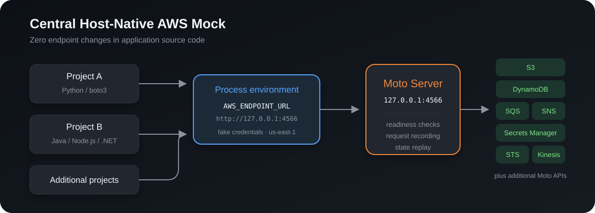
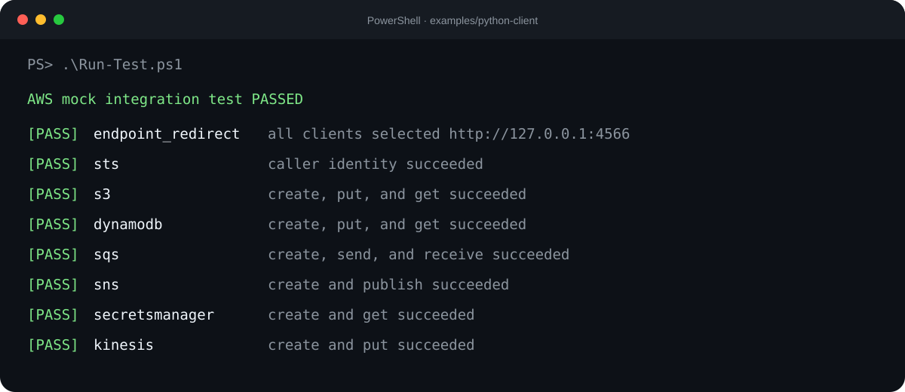

# Central Host-Native AWS Mock

[](https://github.com/pinghunter-Shubham/AWS-MOCK/actions/workflows/test.yml)
[](LICENSE)
[](https://www.python.org/)
[](https://github.com/getmoto/moto)

A centralized AWS-compatible development environment that runs directly on
Windows. Multiple local applications can use common AWS services through their
standard SDK clients without embedding a local endpoint in application source
code.



## Why this project exists

Applications that integrate with AWS often need S3 buckets, DynamoDB tables,
queues, topics, secrets, and streams before they can start. Requiring a real AWS
account for every local workflow adds cost, latency, credentials, and cleanup.

This project provides one reusable local endpoint at
`http://127.0.0.1:4566`. Supported AWS SDKs are redirected with the standard
`AWS_ENDPOINT_URL` environment setting, while application client construction
remains unchanged.

## Features

- Zero endpoint changes in application source code.
- One central service shared by multiple projects.
- Process-scoped fake credentials and region configuration.
- Automated installation, startup, readiness checks, and shutdown.
- Idempotent default resource provisioning.
- Request recording and replay across server restarts.
- Deep integration test covering seven AWS services.
- Windows GitHub Actions verification.
- Detailed operations, recovery, security, and service examples.

## Tested services

| Service | Verified operations |
|---|---|
| AWS STS | Caller identity |
| Amazon S3 | Create bucket, put object, get object, cleanup |
| Amazon DynamoDB | Create table, put item, get item, cleanup |
| Amazon SQS | Create queue, send message, receive message, cleanup |
| Amazon SNS | Create topic, publish message, cleanup |
| AWS Secrets Manager | Create secret, retrieve secret, cleanup |
| Amazon Kinesis | Create stream, put record, cleanup |

Moto supports additional AWS APIs. Support is operation-specific; consult the
[Moto service catalog](https://docs.getmoto.org/en/latest/docs/services/) before
depending on an untested operation.

## Five-minute quick start

### Prerequisites

- Windows PowerShell or PowerShell 7
- Python 3.10 or newer
- TCP port `4566` available

### Install and start

```powershell
git clone https://github.com/pinghunter-Shubham/AWS-MOCK.git
cd .\AWS-MOCK

# Only needed when local script execution is restricted.
Set-ExecutionPolicy -Scope Process -ExecutionPolicy Bypass

.\host-moto\scripts\Install-AwsMock.ps1
.\host-moto\scripts\Start-AwsMock.ps1
.\host-moto\scripts\Get-AwsMockStatus.ps1
```

Expected status:

```text
AWS Mock is running at http://127.0.0.1:4566 (HTTP 200).
```

### Run the central smoke test

```powershell
& .\host-moto\.venv\Scripts\python.exe .\host-moto\smoke_test.py
```

### Connect another project

Run these commands in the terminal that will start the application:

```powershell
. .\host-moto\scripts\Use-AwsMock.ps1
Enable-AwsMock

# Start the application from this same terminal.
# python app.py
# npm start
# dotnet run

Disable-AwsMock
```

`Enable-AwsMock` sets process-level values including:

```dotenv
AWS_ENDPOINT_URL=http://127.0.0.1:4566
AWS_ACCESS_KEY_ID=test
AWS_SECRET_ACCESS_KEY=test
AWS_DEFAULT_REGION=us-east-1
AWS_REGION=us-east-1
AWS_EC2_METADATA_DISABLED=true
AWS_IGNORE_CONFIGURED_ENDPOINT_URLS=false
```

No real AWS credentials are required.

## Prove zero-code SDK redirection

The independent example creates normal boto3 clients such as:

```python
s3 = boto3.client("s3")
dynamodb = boto3.client("dynamodb")
sqs = boto3.client("sqs")
```

There is no `endpoint_url` in the application. The launcher supplies the endpoint
through the process environment.

Run the complete example:

```powershell
cd .\examples\python-client
.\Install.ps1
.\Run-Test.ps1
```



Temporary resources are deleted by the test even when an assertion fails.

## Default resources

The start script creates these resources when they do not already exist:

| Service | Resource |
|---|---|
| S3 | `dev-app-bucket` |
| DynamoDB | `dev-app-table` |
| SQS | `dev-app-queue` |
| SNS | `dev-app-topic` |
| Secrets Manager | `dev/app/config` |
| Kinesis | `dev-app-stream` |

Use project-prefixed names for additional resources because every connected
project shares the same local account and region.

## Project layout

```text
AWS-MOCK/
|-- .github/
|   `-- workflows/test.yml
|-- docs/assets/
|-- examples/python-client/
|-- host-moto/
|   |-- scripts/
|   |-- bootstrap.py
|   |-- smoke_test.py
|   `-- requirements.txt
|-- AWS_MOCK_COMPLETE_GUIDE.md
|-- LICENSE
`-- README.md
```

Generated virtual environments, logs, process IDs, and request recordings are
excluded from version control.

## Operations

```powershell
# Status
.\host-moto\scripts\Get-AwsMockStatus.ps1

# Stop while retaining the request recording
.\host-moto\scripts\Stop-AwsMock.ps1

# Start and replay the retained recording
.\host-moto\scripts\Start-AwsMock.ps1
```

Runtime files are stored under `host-moto\logs` and `host-moto\state`.

## Documentation

- [Complete setup and operations guide](AWS_MOCK_COMPLETE_GUIDE.md)
- [Host implementation details](host-moto/README.md)
- [Independent Python integration example](examples/python-client/README.md)

## Limitations

- Moto emulates a subset of AWS behavior and should not replace final validation
  in a real AWS test account.
- IAM enforcement, quotas, latency, eventual consistency, and generated IDs can
  differ from AWS.
- Request replay reconstructs common development state but is not a transactional
  database snapshot.
- Lambda and Batch workload execution are not provided by this host-native setup.
- Older SDKs that ignore `AWS_ENDPOINT_URL` require an SDK update or another
  supported endpoint configuration mechanism.

## Security

- Use only the fake local credentials supplied by this project.
- Never store production secrets or customer data in the mock.
- Keep the endpoint bound to `127.0.0.1`.
- Run `Disable-AwsMock` before using a terminal for real AWS operations.
- Confirm the target account is `123456789012` before changing resources.

## License

Licensed under the [Apache License 2.0](LICENSE).

## Disclaimer

This is an independent development project built using
[Moto](https://github.com/getmoto/moto). It is not affiliated with, sponsored by,
or endorsed by Amazon Web Services. AWS service names are used only to describe
API compatibility and integrations.
